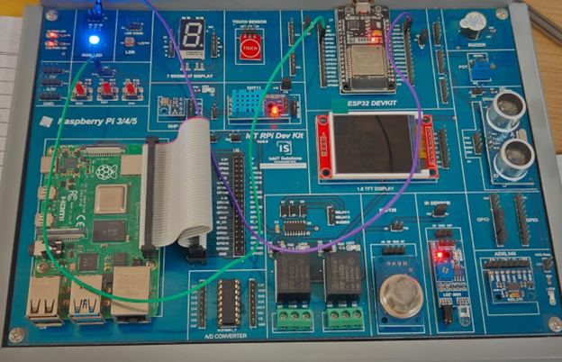

# Lab 1: Working of LED with a Push Button 🚨

## Program Description

This program demonstrates the basic working of an LED and a push button using an Arduino board. When the push button is pressed, the LED turns on. When the button is released, the LED turns off.

## Components Required

- 🛠️ Arduino Board (e.g., Arduino Uno, ESP32)
- 🔘 1 x Push Button
- 💡 1 x LED
- ⚡ 1 x Resistor (220 ohms for the LED, optional pull-down resistor for the button if needed)
- 🔌 Jumper Wires
- 🧩 Breadboard

## Pin Connections

<table>
  <thead>
    <tr>
      <th>Component</th>
      <th>Pin on Arduino</th>
      <th>Other Connections</th>
    </tr>
  </thead>
  <tbody>
    <tr>
      <td>Push Button</td>
      <td>Digital Pin 4</td>
      <td>Connected to GND through a pull-down resistor (optional); connected to +5V or 3.3V</td>
    </tr>
    <tr>
      <td>LED (Anode)</td>
      <td>Digital Pin 13</td>
      <td></td>
    </tr>
    <tr>
      <td>LED (Cathode)</td>
      <td>GND</td>
      <td>Connected through a 220-ohm resistor</td>
    </tr>
  </tbody>
</table>

## Required Libraries

No additional libraries are required for this program. It uses the built-in functions of the Arduino core.

## How the Program Works

1. 🖥️ The **setup()** function initializes the LED pin as an output and the button pin as an input.
2. 🔄 In the **loop()** function:
   - The state of the push button is read using `digitalRead(buttonPin)`.
   - If the button is pressed (`buttonState == HIGH`), the LED is turned on using `digitalWrite(ledPin, HIGH)`.
   - If the button is not pressed, the LED is turned off using `digitalWrite(ledPin, LOW)`.
3. ⏱️ An optional delay of 50ms is added to debounce the button.

## Circuit Diagram

## Notes

- 🛡️ If using an ESP32, ensure that **Digital Pin 13** is not used for other purposes on your specific board.
- ⚙️ Use a pull-down resistor on the push button to avoid floating pin states.
- 🕒 The delay can be adjusted or removed depending on the button debounce requirement.
