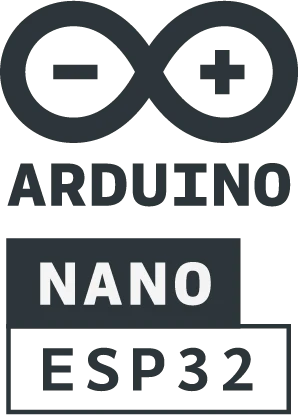
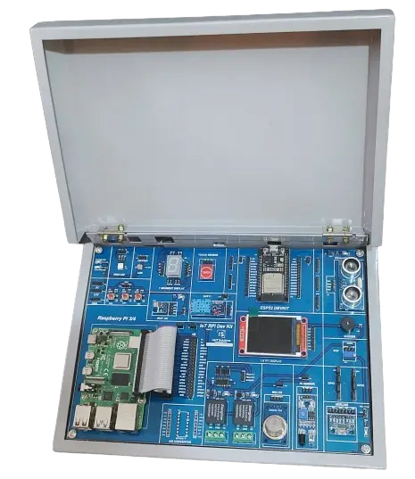

# 🛠️ **Arduino & ESP32 IoT Dev Kit Projects** 🛠️

<p align="center">
<b>
IOT | Arduino | ESP32 | Sensor Projects | Distance Measurement | Collision Detection | Temperature Monitoring | IoT Projects | DHT Sensor | Ultrasonic Sensor | Infrared Sensor | Servo Motor Control | Traffic Light Simulation | Environmental Monitoring | DIY IoT Kit | IoT Dev Kit | IoT Sensors | IoT Tutorials
</b>
</p>

<div align="center" >

</div>

## Welcome to My Collection of 12 Hands-On Projects! 🚀

If you’re passionate about electronics, coding, and building exciting IoT projects, you’ve come to the right place! 🤖💡

This series of Arduino and ESP32-based projects is designed to take you step-by-step through building innovative devices and systems. Whether you're a beginner or a seasoned pro, these projects will equip you with the skills to create real-world solutions. From controlling LEDs to measuring distance, detecting collisions, and monitoring environmental conditions like temperature and humidity, this series covers it all! 🌡️🌍

Get ready to roll up your sleeves and dive into the world of IoT, electronics, and programming with hands-on learning that’s both fun and rewarding! 🔧💻

## 📖 **What You'll Learn** 🤓

In these 12 programs, we explore:

1. 🌟 **Basic LED control** (like blinking and patterns)
2. 🛠️ **Motor control** (e.g., rotating servo motors)
3. 🔘 **Sensor interfacing** (including IR, ultrasonic, and temperature sensors)
4. 🚦 **Traffic light simulation** (get ready for real-world traffic challenges!)
5. 💨 **Distance measuring** (get those ultrasonic sensors working!)
6. 🔊 **Collision detection** (avoid those bumps with IR sensors)
7. 🌡️ **Environment monitoring** (track humidity, temperature, and heat index)

All these projects are built using **Arduino**, **ESP32**, and some cool external sensors and modules. These are just a few examples of the countless possibilities you can achieve with **IoT** (Internet of Things). 🌐

## 📖 **Required Setup** 🧑‍💻

Before we dive into the projects, make sure your **Arduino IDE** is properly set up and ready for action! Here's what you'll need to do:

### 1. **Install Arduino IDE** 💻

Download and install the latest version of the **Arduino IDE** from [here](https://www.arduino.cc/en/software).

### 2. **Set up ESP32 Board** 🔧

- Go to **File > Preferences** in the Arduino IDE and add the following URL to the "Additional Boards Manager URLs":
  ```
  https://dl.espressif.com/dl/package_esp32_index.json
  ```
- Then, go to **Tools > Board > Boards Manager** and install **ESP32 by Espressif Systems**.

### 3. **Install Required Libraries** 📚

Some projects may require specific libraries like **DHT Sensor Library** or **Servo Motor Library**. You can install them via **Sketch > Include Library > Manage Libraries**.

## 🧰 **IoT RPI Dev Kit** 🎉

<p>A special shoutout to the <strong>IoT RPI Dev Kit</strong> that powers these projects! Here’s the kit I used for all these experiments:</p>

<table border="1" cellpadding="10">
  <tr>
    <th><strong>IoT RPI Dev Kit</strong></th>
    <th><strong>Specifications</strong></th>
  </tr>
  <tr>
    <td></td>
    <td>
      <ul>
        <li>RGB LED</li>
        <li>LDR</li>
        <li>Ultrasonic Sensor</li>
        <li>IR Sensor</li>
        <li>Touch Sensor</li>
        <li>DHT11</li>
        <li>MQ135</li>
        <li>Two Relays</li>
        <li>BMP-180</li>
        <li>ADXL345</li>
        <li>Buzzer</li>
        <li>POT</li>
        <li>7-segment Display</li>
        <li>1.8 TFT Display</li>
        <li>Three Push Button Switches</li>
        <li>A/D Converter</li>
      </ul>
    </td>
  </tr>
  <tr>
    <td><strong>Raspberry Pi 4B</strong> (2/4/8GB)</td>
    <td>Includes <strong>Power Adapter</strong>, <strong>HDMI Cable</strong>, and <strong>32GB SD Card</strong> (Pre-loaded OS)</td>
  </tr>
  <tr>
    <td><strong>ESP32 DevKit</strong></td>
    <td>Used for most of the sensor-based projects. 🌐</td>
  </tr>
</table>

You can find more details and purchase this amazing kit from [IObit](https://www.iobit.in/shop/iot-rpi-dev-kit-9). 🎁

## 🖥️ **List of Projects** 📜

Here are the 12 awesome projects you'll be diving into:

1. **Lab 1**: LED Blinking Program
2. **Lab 2**: LED Pattern Display
3. **Lab 3**: Button-Controlled LED
4. **Lab 4**: Servo Motor Control
5. **Lab 5**: Servo Motor Rotation (Clockwise and Counterclockwise)
6. **Lab 6**: Traffic Light Simulation
7. **Lab 7**: LED Scrolling Pattern (Left to Right and Right to Left)
8. **Lab 8**: Temperature and Humidity Monitoring Using DHT Sensor
9. **Lab 9**: LED Scrolling Simulation (Left to Right and Right to Left)
10. **Lab 10**: Distance Measurement Using Ultrasonic Sensor
11. **Lab 11**: Collision Detection Using Infrared Sensor
12. **Lab 12**: Interfacing Temperature Sensor to Read Room Temperature, Humidity, and Heat

Each of these programs is designed to help you learn something new and add a new skill to your IoT toolkit. 🚀

## 🎉 **Fun with IoT!** 🤩

Whether you're just starting out or already a pro, these projects will bring out your creativity. With sensors, motors, LEDs, and displays, you'll learn how to make your ideas come to life! 💡💥

> **Author**: All credit goes to **AskitEndo** (that’s me, your IoT buddy)! Check out my projects and tutorials on my [GitHub](https://github.com/askitendo). 🎉
