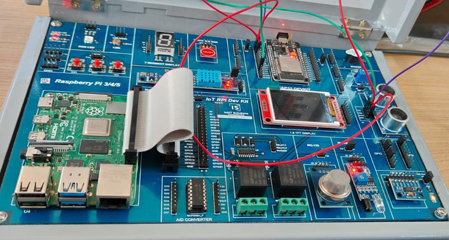
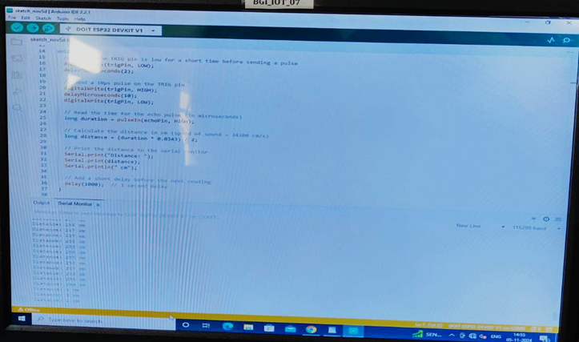

# Program 10: Program to Calculate Distance of an Object Using an Ultrasonic Sensor 🌍

## Program Description

This program calculates the distance of an object using an ultrasonic sensor. The sensor sends a sound pulse and measures the time it takes for the pulse to return. This time is then converted into distance.

## Components Required

• 🛠️ **Arduino Board** (e.g., Arduino Uno, ESP32, etc.)  
• 🌊 **Ultrasonic Sensor** (e.g., HC-SR04)  
• 🔌 **Jumper Wires**  
• 🧩 **Breadboard**

## Pin Connections

| Component           | Arduino Pin | Description             |
| ------------------- | ----------- | ----------------------- |
| **Ultrasonic TRIG** | Pin 3       | Sends a trigger pulse   |
| **Ultrasonic ECHO** | Pin 1       | Receives the echo pulse |

## Required Libraries

To run this program, you need the following libraries installed:

• **None required for this program**, as it does not rely on any external libraries. The `pulseIn()` function, which is built into the Arduino IDE, handles the measurement of the ultrasonic pulse duration.

## Circuit Diagram



## Monitor Output



## How the Program Works

1. **Setup Phase**: The TRIG and ECHO pins are initialized, and the serial monitor is set up to display the distance readings.
2. **Distance Measurement**:
   - The TRIG pin sends a 10µs pulse to trigger the ultrasonic sensor.
   - The sensor sends out an ultrasonic pulse, which bounces off an object and returns to the ECHO pin.
   - The program measures the duration of the pulse’s return trip using the `pulseIn()` function.
3. **Distance Calculation**: The duration is used to calculate the distance based on the speed of sound (34300 cm/s).
4. **Display**: The calculated distance is displayed on the serial monitor.

## Notes

• The `delay(1000)` in the loop provides a 1-second pause between readings.  
• The sensor works by emitting a high-frequency sound pulse, and the distance is calculated based on the time taken for the pulse to travel to the object and back.  
• Ensure that the ultrasonic sensor is placed properly, with the ECHO pin facing the object to ensure accurate readings.

## Example Output

• When an object is detected at a distance of 30 cm, the serial monitor will display:

```
Distance: 30 cm
```
