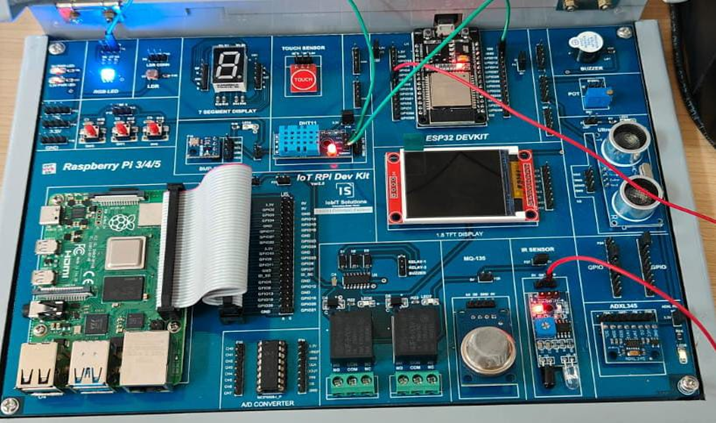
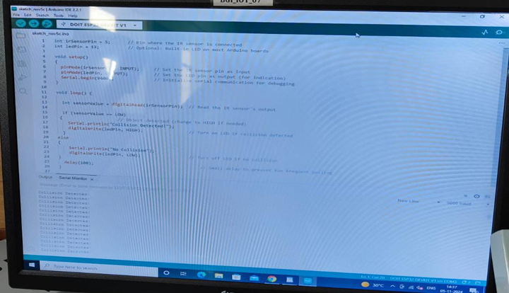

# Program 11: Program to Detect Collision Using Infrared Sensor 🚗

## Program Description

This program detects a collision using an infrared (IR) sensor. It reads the sensor's output and triggers a collision detection message when an object is detected. It also lights up an LED as an indication.

## Components Required

• 🛠️ **Arduino Board** (e.g., Arduino Uno, ESP32, etc.)  
• 🌐 **Infrared Sensor** (e.g., IR Module)  
• 🔆 **LED** (optional, built-in LED can be used)  
• 🔌 **Jumper Wires**  
• 🧩 **Breadboard**

## Pin Connections

| Component     | Arduino Pin | Description                              |
| ------------- | ----------- | ---------------------------------------- |
| **IR Sensor** | Pin 7       | Receives signal from IR sensor           |
| **LED**       | Pin 13      | Indicates collision detection (optional) |

## Required Libraries

To run this program, no additional libraries are needed. The `digitalRead()` function, built into the Arduino IDE, is sufficient to read the sensor's output.

## Circuit Diagram



## Monitor Output



## How the Program Works

1. **Setup Phase**: The IR sensor pin is set as an input, and the LED pin is set as an output.
2. **Collision Detection**:
   - The program reads the IR sensor's output using `digitalRead()`.
   - If an object is detected (the sensor outputs LOW), the program prints "Collision Detected!" on the serial monitor.
   - The built-in LED or an external LED lights up to indicate a collision.
   - If no object is detected (sensor outputs HIGH), it prints "No Collision" on the serial monitor and turns off the LED.
3. **Delay**: A small delay (`delay(100)`) prevents too frequent polling of the IR sensor.

## Notes

• The IR sensor typically outputs a LOW signal when it detects an object and a HIGH signal when there is no object in front of it. You may need to adjust the logic based on your sensor's behavior.  
• Ensure the IR sensor is positioned correctly for accurate collision detection.

## Example Output

• When a collision is detected:

```
Collision Detected!
```

• When no collision is detected:

```
No Collision
```
