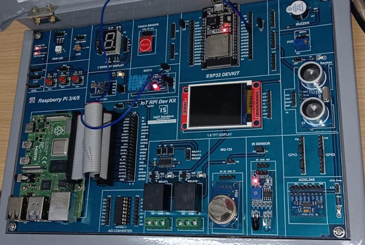

# Program 12: Program to Interface Temperature Sensor to Read Room Temperature, Humidity, and Heat 🌡️

## Program Description

This program interfaces a DHT11 sensor (or DHT22) with an Arduino (or ESP32) to read the room temperature, humidity, and heat index. The data is displayed on the serial monitor.

## Components Required

• 🛠️ **Arduino Board** (e.g., Arduino Uno, ESP32, etc.)  
• 🌡️ **DHT11 Temperature and Humidity Sensor**  
• 🔌 **Jumper Wires**  
• 🧩 **Breadboard**

## Pin Connections

| Component      | Arduino Pin | Description                         |
| -------------- | ----------- | ----------------------------------- |
| **DHT Sensor** | Pin 26      | Reads temperature and humidity data |

## Required Libraries

To run this program, you need the following library installed:

• **DHT Sensor Library**: For interfacing with the DHT11 sensor.  
 (Install via the **Library Manager** in Arduino IDE)

## Circuit Diagram



## How the Program Works

1. **Setup Phase**:
   - The DHT sensor is initialized using the specified pin and sensor type (DHT11 or DHT22).
   - Serial communication is started for displaying data.
2. **Reading Data**:
   - The program reads the humidity and temperature values from the DHT sensor.
   - It also calculates the heat index based on the temperature and humidity values.
3. **Output**:
   - The humidity, temperature (both in Celsius and Fahrenheit), and heat index (in Celsius and Fahrenheit) are printed on the serial monitor.
   - The program runs every 2 seconds (due to the `delay(2000)`), continuously providing updated readings.
4. **Error Handling**:
   - If any sensor reading fails, the program prints an error message and stops execution for that cycle.

## Notes

• The program uses the `DHT` library to interact with the sensor and the `computeHeatIndex()` function to calculate the heat index.
• The heat index is a measure of how hot it feels when humidity is factored in with the actual air temperature.
• Make sure to connect the DHT sensor correctly, ensuring the sensor’s data pin is connected to the specified pin (26 for ESP32 in this case).

## Example Output

• When the temperature is 25°C, humidity is 60%, and the heat index is calculated, the output will look like this:

```
Humidity: 60.00 %    Temperature: 25.00 °C  77.00 °F    Heat index: 25.56 °C  78.00 °F
```
