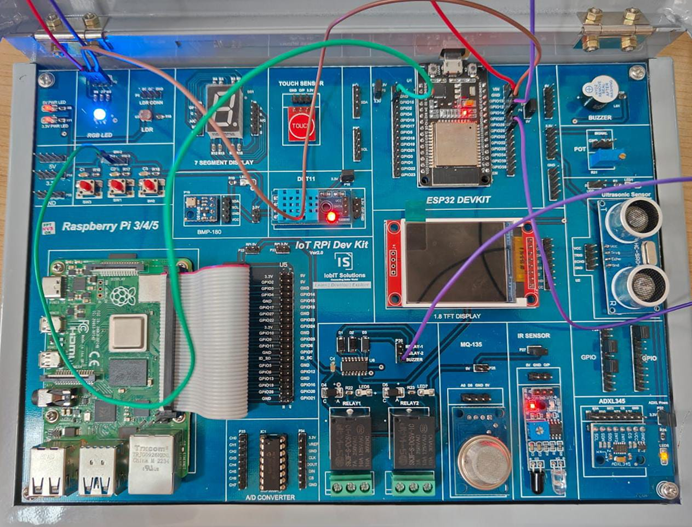

# Program 2: Traffic Lights for Pedestrians 🚦

## Program Description

This program simulates the working of a pedestrian traffic light system with red, yellow, and green lights. The red light stays on for 15 seconds, followed by the yellow light with several flashing intervals. The green light stays on for 20 seconds.

## Components Required

• 🛠️ **Arduino Board** (e.g., Arduino Uno, ESP32)  
• 🔴 **1 x Red LED**  
• 🟡 **1 x Yellow LED**  
• 🟢 **1 x Green LED**  
• 🔌 **Jumper Wires**  
• 🧩 **Breadboard**

## Pin Connections

<table>  
  <thead>  
    <tr>  
      <th>Component</th>  
      <th>Pin on Arduino</th>  
    </tr>  
  </thead>  
  <tbody>  
    <tr>  
      <td>Red LED</td>  
      <td>Pin 9</td>  
    </tr>  
    <tr>  
      <td>Yellow LED</td>  
      <td>Pin 8</td>  
    </tr>  
    <tr>  
      <td>Green LED</td>  
      <td>Pin 7</td>  
    </tr>  
  </tbody>  
</table>

## Required Libraries

No additional libraries are required for this program. It uses the built-in functions of the Arduino core.

## How the Program Works

1. **Pin Setup**: The red, yellow, and green LEDs are connected to pins 9, 8, and 7, respectively. These pins are set as output in the `setup()` function.

2. **Red Light**: The red light is turned on for 15 seconds using `digitalWrite(red, HIGH)` and then turned off after 15 seconds (`digitalWrite(red, LOW)`).

3. **Yellow Light Flashing**: The yellow light flashes in intervals of 1 second ON and 0.5 seconds OFF. This cycle is repeated five times for a total of flashing cycles.

4. **Green Light**: The green light stays on for 20 seconds using `digitalWrite(green, HIGH)` and is then turned off.

5. **Yellow Light Flashing Again**: After the green light, the yellow light flashes again for three cycles before restarting the whole process.

## Circuit Diagram

## Notes

• ⚙️ Ensure the LEDs are connected with appropriate resistors (220 ohms for each LED).  
• 🟡 The yellow light flashes multiple times to simulate the warning phase before the green light and after it.
