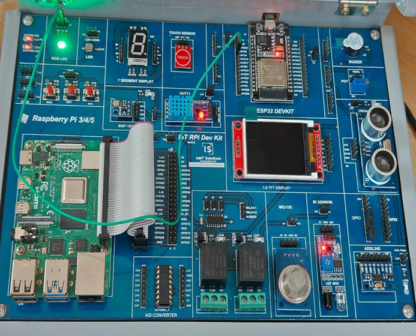

# Program 3: Fading the LED 🌟

## Program Description

This program demonstrates the fading effect of an LED by gradually increasing and decreasing its brightness. The LED fades in (brightness increases) and fades out (brightness decreases) using Pulse Width Modulation (PWM).

## Components Required

• 🛠️ **Arduino Board** (e.g., Arduino Uno, ESP32)  
• 💡 **1 x LED**  
• 🔌 **Jumper Wires**  
• 🧩 **Breadboard**

## Pin Connections

<table>  
  <thead>  
    <tr>  
      <th>Component</th>  
      <th>Pin on Arduino</th>  
    </tr>  
  </thead>  
  <tbody>  
    <tr>  
      <td>LED</td>  
      <td>Pin 4 (PWM Pin)</td>  
    </tr>  
  </tbody>  
</table>

## Required Libraries

No additional libraries are required for this program. It uses the built-in functions of the Arduino core.

## How the Program Works

1. **Pin Setup**: The LED is connected to a PWM pin (pin 4), which is set as an output in the `setup()` function.

2. **LED Fading In**: The brightness of the LED starts from 0 and increases to 255 in steps of 5. The `analogWrite()` function is used to control the brightness, and a 30ms delay is added to make the change smooth.

3. **LED Fading Out**: The brightness of the LED starts from 255 and decreases to 0 in steps of 5, following the same process as fading in.

4. **Continuous Loop**: The process of fading in and out repeats continuously in the `loop()` function.

## Circuit Diagram

## Notes

• ⚙️ Ensure that the LED is connected with an appropriate current-limiting resistor (typically 220 ohms).  
• 🖥️ This code uses PWM to control the brightness of the LED, so make sure the pin supports PWM on your Arduino board.
