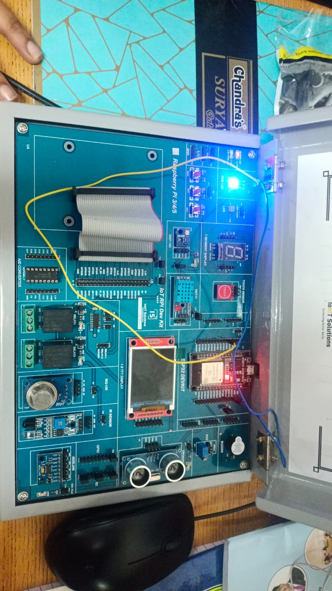

# Program 4: Blink Odd and Even LEDs with Serial Output 💡

## Program Description

This program demonstrates how to blink two LEDs (red and blue) in an alternating pattern using an ESP32. The red LED (odd) and blue LED (even) blink alternately, and the program prints whether the current number is odd or even to the serial monitor every second.

## Components Required

• 🛠️ **ESP32 Board**  
• 💡 **2 x LEDs** (Red and Blue)  
• 🔌 **Jumper Wires**  
• 🧩 **Breadboard**  
• ⚡ **Resistors** (220 ohms for each LED)

## Pin Connections

| Component | ESP32 GPIO Pin |
| --------- | :------------: |
| Red LED   |     GPIO 4     |
| Blue LED  |    GPIO 13     |

## Required Libraries

No additional libraries are required for this program. It uses the built-in functions of the Arduino core.

## How the Program Works

1. **Pin Setup**: The red LED is connected to GPIO 4 and the blue LED to GPIO 13. Both are set as OUTPUT in the `setup()` function.
2. **Blinking Pattern**: In the `loop()`, the red LED turns ON and blue LED turns OFF for 500ms, then the red LED turns OFF and blue LED turns ON for 500ms, creating an alternating blink effect.
3. **Serial Output**: Every second, the program prints whether the current number is odd or even to the serial monitor and increments the number.
4. **Continuous Loop**: This pattern repeats continuously in the `loop()` function.

## Circuit Diagram

## Notes

• ⚙️ Ensure that each LED is connected with a current-limiting resistor (typically 220 ohms).
• 🖥️ The delay time (500ms) can be adjusted in the code to control how fast the LEDs blink.
• 🖨️ Open the Serial Monitor at 115200 baud to view the odd/even number output.
