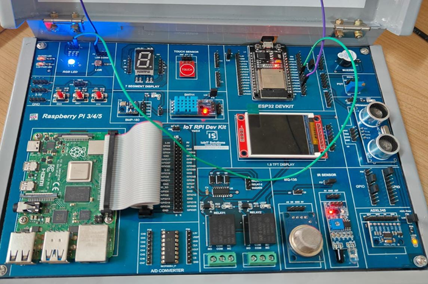

# Program 6: Simulate the Interfacing of LDR with Arduino to Control LED Intensity 🌞💡

## Program Description

This program demonstrates how to interface an LDR (Light Dependent Resistor) with an Arduino. The intensity of an LED is controlled based on the amount of light detected by the LDR. When the surrounding light intensity decreases, the LED brightness increases, and vice versa.

## Components Required

• 🛠️ **Arduino Board** (e.g., Arduino Uno, ESP32)  
• 🔦 **Light Dependent Resistor (LDR)**  
• 💡 **LED**  
• 🔌 **Jumper Wires**  
• 🧩 **Breadboard**  
• 🔋 **Resistor** (10kΩ for LDR voltage divider circuit)

## Pin Connections

<table>  
  <thead>  
    <tr>  
      <th>Component</th>  
      <th>Pin on Arduino</th>  
    </tr>  
  </thead>  
  <tbody>  
    <tr>  
      <td>LDR</td>  
      <td>Analog Pin A0 (ESP32: Pin 34)</td>  
    </tr>  
    <tr>  
      <td>LED</td>  
      <td>PWM Pin D9 (ESP32: Pin 25)</td>  
    </tr>  
  </tbody>  
</table>

## Required Libraries

No additional libraries are required for this program since it uses built-in Arduino functions like `analogRead()`, `analogWrite()`, and `map()`. These functions are a part of the core Arduino framework.

## How the Program Works

1. **Reading LDR Value**: The LDR's analog value is read using `analogRead()`. The value ranges between **0 and 1023** on Arduino or **0 and 4095** on ESP32.
2. **Mapping Brightness**: The LDR value is mapped to a brightness range of **0-255**, which is suitable for PWM control.
3. **Controlling LED Intensity**: The LED brightness is controlled using the `analogWrite()` function, where lower light intensity increases the LED brightness.
4. **Debugging**: The LDR value is displayed on the Serial Monitor for real-time monitoring.

## Circuit Diagram

## Notes

• 📶 Ensure a **voltage divider circuit** is used with the LDR for proper analog readings. Use a **10kΩ resistor** in the divider circuit.  
• 💻 The program is compatible with both Arduino and ESP32 but note the difference in analog reading ranges: **Arduino (0-1023)**, **ESP32 (0-4095)**.  
• ⚡ Make sure the LED is connected to a **PWM-capable pin**.
