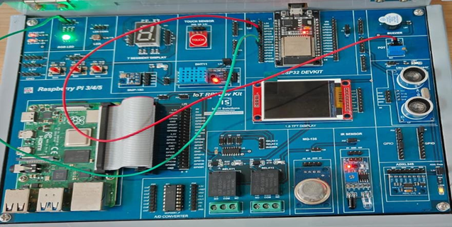
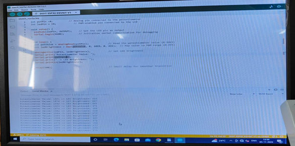

# Program 7: Simulate the Working of a Potentiometer and LED 💡

## Program Description

This program demonstrates how to use a potentiometer to control the intensity of an LED. The potentiometer's analog input is read and mapped to the LED's brightness using PWM (Pulse Width Modulation).

## Components Required

• 🛠️ **Arduino Board** (e.g., Arduino Uno, ESP32)  
• ⚙️ **Potentiometer** (10kΩ recommended)  
• 💡 **LED**  
• 🔌 **Jumper Wires**  
• 🧩 **Breadboard**

## Pin Connections

<table>  
  <thead>  
    <tr>  
      <th>Component</th>  
      <th>Pin on Arduino</th>  
    </tr>  
  </thead>  
  <tbody>  
    <tr>  
      <td>Potentiometer (Middle Pin)</td>  
      <td>Analog Pin A0 (ESP32: Pin 4)</td>  
    </tr>  
    <tr>  
      <td>Potentiometer (One Side Pin)</td>  
      <td>VCC (+5V)</td>  
    </tr>  
    <tr>  
      <td>Potentiometer (Other Side Pin)</td>  
      <td>GND</td>  
    </tr>  
    <tr>  
      <td>LED</td>  
      <td>PWM Pin D9</td>  
    </tr>  
  </tbody>  
</table>

## Required Libraries

No additional libraries are required for this program as it utilizes built-in Arduino functions like `analogRead()`, `analogWrite()`, and `map()`.

## How the Program Works

1. **Potentiometer as Input**: The potentiometer is read using the `analogRead()` function, which gives a value ranging between **0 and 1023**.
2. **Mapping to LED Brightness**: The potentiometer value is mapped to the PWM range (0-255) using the `map()` function.
3. **Controlling the LED**: The LED's brightness is controlled via the `analogWrite()` function based on the mapped value.
4. **Debugging**: The potentiometer value and corresponding LED brightness are printed to the Serial Monitor for real-time observation.

## Circuit Diagram

 

## Notes

• 📶 Ensure the potentiometer is connected in a **voltage divider configuration** to provide variable voltage output.  
• 💻 The program is compatible with both Arduino and ESP32.  
• ⚡ Ensure the LED is connected to a **PWM-capable pin** on the board.
