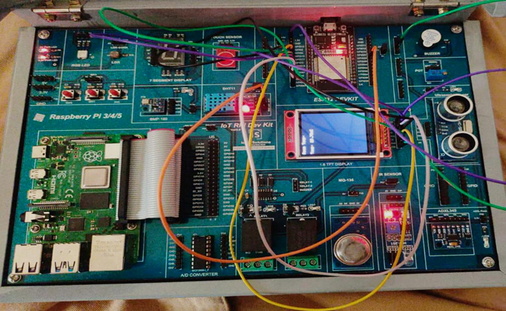
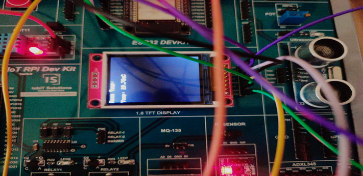

# Program 8: Simulate the Working of a DHT Sensor with SPI TFT LCD Display 🌡️

## Program Description

This program demonstrates the integration of a **DHT11 sensor** with an **SPI TFT LCD display** to monitor and display room temperature in real-time.
The temperature reading is taken from the DHT sensor and displayed on the TFT screen using the Adafruit ST7735 library.

## Components Required

• 🛠️ **ESP32 Board**  
• 🌡️ **DHT11 Temperature and Humidity Sensor**  
• 📟 **SPI TFT LCD Display (ST7735 based)**  
• 🔌 **Jumper Wires**  
• 🧩 **Breadboard**  
• ⚡ **Resistors** (if needed for LED backlight)

## Pin Connections

### DHT11 Sensor

| Component  | ESP32 Pin |
| ---------- | --------- |
| DHT11 VCC  | 3.3V      |
| DHT11 GND  | GND       |
| DHT11 Data | GPIO 26   |

### SPI TFT LCD Display

| LCD Pin | ESP32 Pin | Function     |
| ------- | --------- | ------------ |
| VCC     | 3.3V/5V   | Power        |
| GND     | GND       | Ground       |
| SCK     | GPIO 18   | SPI Clock    |
| SDA     | GPIO 23   | SPI MOSI     |
| A0      | GPIO 16   | Data/Command |
| RES     | GPIO 17   | Reset        |
| CS      | GPIO 5    | Chip Select  |
| LED     | 3.3V/5V   | Backlight    |

📝 **Note**: The SDA pin on the LCD is SPI MOSI, not I2C SDA.

## Required Libraries

To run this program, you need the following Arduino libraries installed:

1. **DHT Sensor Library**: For reading temperature and humidity values from the DHT11 sensor.
2. **Adafruit GFX Library**: Base graphics library for Adafruit displays.
3. **Adafruit ST7735 Library**: For interfacing with the SPI TFT LCD display.

Install these libraries using the **Library Manager** in the Arduino IDE:

- Go to `Sketch > Include Library > Manage Libraries`
- Search for and install:
  - `DHT sensor library` by Adafruit
  - `Adafruit GFX Library`
  - `Adafruit ST7735 and ST7789 Library`

## How the Program Works

1. **Sensor Initialization**: The program initializes the DHT sensor and SPI TFT display during the `setup()` function.
2. **Display Setup**: The TFT screen is initialized with black background, white text, and displays "Room Temp:" message.
3. **Temperature Reading**: The `dht.readTemperature()` function retrieves the temperature data from the DHT11 sensor.
4. **Error Handling**: If the sensor fails to provide a reading, an error message is displayed on the TFT and printed to the Serial Monitor.
5. **Displaying Data**: The temperature value is displayed on the TFT screen and updated every 2 seconds. Previous readings are cleared before displaying new ones.

## Circuit Diagram

## Monitor Diagram

## Notes

- ⚙️ Ensure all SPI connections are properly wired according to the pin configuration table.
- 🔧 If you're using the **DHT22** sensor, change the `#define DHTTYPE` to `DHT22`.
- 📱 The TFT display uses SPI communication, not I2C. Don't confuse the SDA pin with I2C SDA.
- 💡 If the backlight LED pin requires a current-limiting resistor, add one between the LED pin and power supply.
- 🖥️ Open the Serial Monitor at 115200 baud to view temperature readings.
- 🎨 You can customize text colors and sizes by modifying the `tft.setTextColor()` and `tft.setTextSize()` functions.

## Troubleshooting

❌ **Common Issues:**

- **Blank screen**: Check power connections and SPI wiring
- **Garbled display**: Verify A0 (DC) and RES (Reset) pin connections
- **Sensor errors**: Check DHT11 power and data pin connections
