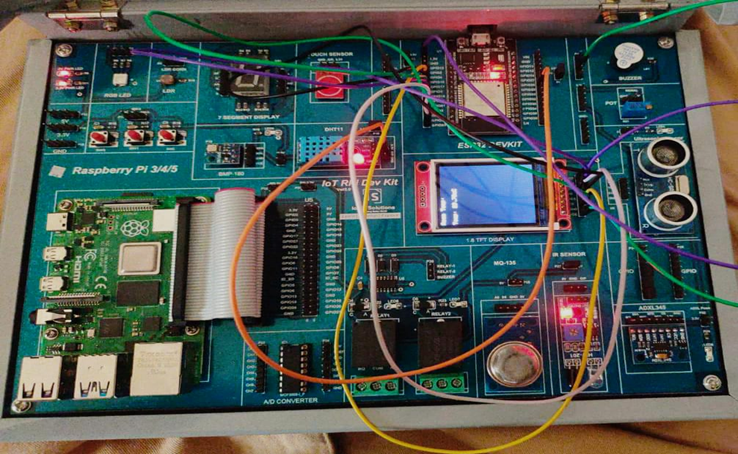

# Program 8: Simulate the Working of a DHT Sensor with LCD Display 🌡️

## Program Description

This program demonstrates the integration of a **DHT11 sensor** with an **I2C LCD display** to monitor and display room temperature in real-time.
The temperature reading is taken from the DHT sensor and displayed on the LCD.

## Components Required

• 🛠️ **Arduino Board** (e.g., ESP32, Arduino Uno)  
 • 🌡️ **DHT11 Temperature and Humidity Sensor**  
 • 📟 **16x2 LCD with I2C Module**  
 • 🔌 **Jumper Wires**  
 • 🧩 **Breadboard**

## Pin Connections

| Component  | Pin on Arduino/ESP32          |
| ---------- | ----------------------------- |
| DHT11 VCC  | +3.3V / +5V                   |
| DHT11 GND  | GND                           |
| DHT11 Data | Digital Pin 26                |
| LCD SDA    | A4 (Arduino) / Pin 21 (ESP32) |
| LCD SCL    | A5 (Arduino) / Pin 22 (ESP32) |

## Required Libraries

To run this program, you need the following Arduino libraries installed:

1.  **DHT Sensor Library**: For reading temperature and humidity values from the DHT11 sensor.
2.  **LiquidCrystal_I2C**: For interfacing with the I2C-enabled LCD display.

Install these libraries using the **Library Manager** in the Arduino IDE:

- Go to `Sketch > Include Library > Manage Libraries`, then search for and install `DHT Sensor Library` and `LiquidCrystal_I2C`.

## How the Program Works

1.  **Sensor Initialization**: The program initializes the DHT sensor and I2C LCD during the `setup()` function.
2.  **Temperature Reading**: The `dht.readTemperature()` function retrieves the temperature data from the DHT11 sensor.
3.  **Error Handling**: If the sensor fails to provide a reading, an error message is displayed on the LCD and printed to the Serial Monitor.
4.  **Displaying Data**: The temperature value is displayed on the LCD along with a degree symbol (`°C`) and updated every 2 seconds.

## Circuit Diagram

## Notes

- Ensure that the I2C address (`0x27`) matches your LCD module's address. Use an I2C scanner program to detect it if necessary.
- If you're using the **DHT22** sensor, change the `#define DHTTYPE` to `DHT22`.
- Connect the LCD's SDA and SCL pins to the appropriate pins on your microcontroller (A4 and A5 for Arduino, 21 and 22 for ESP32).
